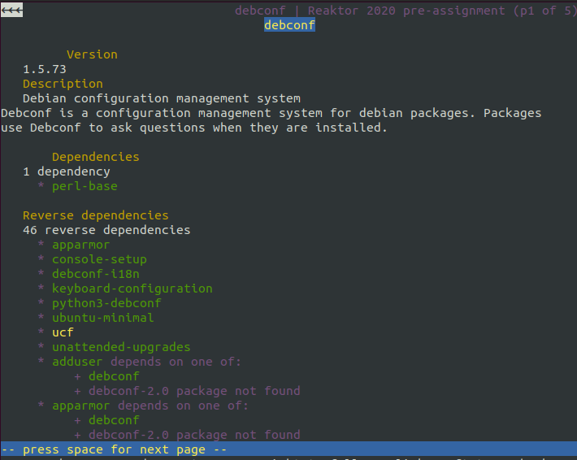

# About
Pre-assignment for Reaktor's 2020 summer junior dev positions. A demo will be available on [Heroku](https://kimsappi-reaktor2020.herokuapp.com/) for a limited time.

The goal of the exercise was to parse the contents of `/var/lib/dpkg/status` (containing package information for Debian-based distributions) and display them in an HTML interface, listing the following information about each package:
* name
* description
* dependencies
* reverse dependencies (packages that depend on current package)
* (reverse) dependencies should link to the package in question

One of the goals of the exercise was to avoid extraneous dependencies. This implementation only depends on Python 3, Flask. Ideally the browser should support `<summary><details>`, but that's not strictly necessary. JavaScript is required for full functionality, but the site is completely usable with Lynx:


Contrary to the original spec I also check the Pre-Depends field. Instead of replicating the display of "Description" to Debian's spec, I respected the formatting of the original text.

# Instructions
Requires Python 3 (e.g. `sudo apt-get install python3`) and Flask.
```shell
git clone https://github.com/kimsappi/reaktor2020.git
cd reaktor2020
pip3 install flask
python3 app.py
```
And open 0.0.0.0:5000 in your browser. If the app falls back to the example file (`/var/lib/dpkg/status` is not accessible on your PC), the package `aaaaatest` is a good package to demo the features.

There's also a Dockerfile available. The app listens to port 5000 by default.

# Assumptions
* package names are unique
* the file is quite well formatted